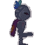
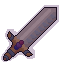

# Log 2 | Game Version 5
 

### Added

* Added a 'Load Sword Pieces' function to the Sword - Adds 'load swordpieces from save' functionality
* Added a Text Bubble transparent platform
* Added Background and Foregrounds
* Created a load_image function to safely load images
* Added Master Swordsman and his Sword, as well as functionality
* Added the Sword UI
* Added a Selection Circle Sprite
* The amount of enemies has a cap
* Added a dash
* Did some stuff with jumping, such as renaming and new variables for springboard functionality
* Added keybind functionality (in the code, not in settings yet)
* Added adapting floor levels and origin points\
* Added Archer, Bow and Projectile classes
* Upon the player droping to 0 health, they teleport back to the Origin Point
* Added Archer to Spawning
* Created Phantom Archer sprite, with functionality
* Added Phantom Archer Bow Functionality
* Implemented knockback
* Chests are now finite. Once they are opened, they cannot be opened again.
* Added an FPS display to the Debug menu
* Difficulty Button in save creator is visible, and has a scroll cooldown
* Added Keybinds to config.json
* Added function to convert certain key phrases (e.g. 'e', 'f11', 'lalt') into their pygame key equivalents (e.g. 'pygame.K_e', 'pygame.K_F11', 'pygame.K_LALT') and another to do the opposite
* Added loading and saving keybinds from config.json

### Changes

* Changelog has been moved to main folder
* Only renders platforms when on screen - fixes lag
* Only spawns enemies when on screen
* Reworked Platforming in attempt to fix the head glitch bug

### Bug Fixes

* Chest is now fully functional
* Wall glitch is fixed
* Transparent platforms now work as intended
* Bridge added into Platform Loader

### Known Bugs

* Glitching to the side of or inside platforms when you jump up into them
* Platforms of levels loaded by entering an exit portal are not included in the platforms list, but are included in the rendering group, meaning you noclip through them despite seeing them
* LLLAAAGGG